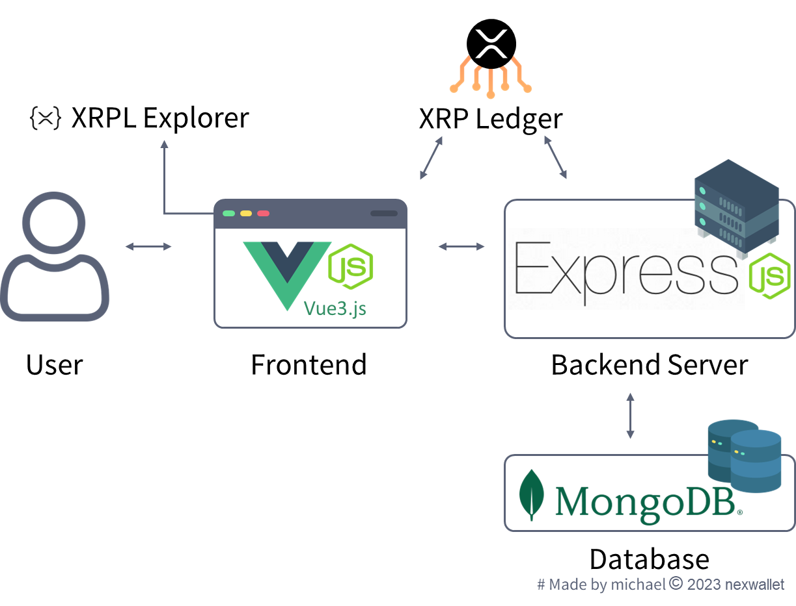

# Welcome to nexWallet
Harnessing the prowess of the XRP Ledger, our platform uses XRP as the backbone for prompt CBDC transactions.

**Main Objective:** 
* Account Management: Dive into easy account creation coupled with XRPL wallet address assignment.
* Interbank Fluidity: Seamlessly pirouette between different banks, enhancing your interbank transaction experience.
* Globetrotter’s Delight: Efficient cross-border transactions empowered with real-time rates. Your money doesn't need a passport!
* Smart Savings: Let your funds flow into savings sub-wallets automatically, based on your chosen percentages. Magic, but real! 
* Transparent Chronicles: A crystal-clear record of your financial stories, easily accessible at a glance.
    
Navigate the digital sea of finances, where we bridge CBDC transfers using XRP. Whether Bob desires to send US-CBDC or any other currency, our wallet ensures Alice perceives it in her desired format. Plus, with our automated savings feature, charting the financial seas becomes a predictable, pleasant voyage.

## Initial Development
Read [`nexWallet/README.md`](./nexWallet/README.md) and [`nexbackend/README.md`](./nexbackend/README.md) to get started and learn how to run this app frontend and backend.

## Built With
* Frontend : Vue3.js
* Backend  : Express.js
* DataBase : MongoDB atlas

## Try it out
🔗 https://nexwallet.kee.tw/

## Demo video
📽 https://youtu.be/BVU1zIamhVA?si=paTNCHwnTtM0C5cq